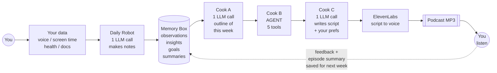

# Architecture

Two-system, agent-based pipeline. Built to be testable from day one.

## One-line view



## System A — Daily Ingestion

Implementation: [`src/pipelines/ingest.ts`](../src/pipelines/ingest.ts) + [`src/agents/ingestion-agent.ts`](../src/agents/ingestion-agent.ts) + [`src/prompts/ingestion.ts`](../src/prompts/ingestion.ts).

A single `gpt-4o` call (JSON mode) that takes:

- New `raw_content` since the last run
- Last 2-4 weeks of `insights` for context
- The user's active `goals`
- Open `goal_candidates`

…and outputs:

- `observations` — atomic facts, each linked to a goal_id when applicable. Some have `goal_id = null` AND `is_goal_candidate = true` when they don't map to existing goals.
- `insights` — synthesized conclusions from 2+ observations, each linked to a goal.
- `goal_candidates` — recurring patterns the user hasn't explicitly named as goals.

After the call, the pipeline:
1. Inserts observations and embeds them (`text-embedding-3-large`).
2. Inserts insights with their `supporting_observation_ids` and embeds them.
3. Inserts goal candidates with their `supporting_observation_ids`.

Per the meeting: *"This doesn't even need to be an agent. There's just an LLM call."*

## System B — Weekly Podcast

Implementation: [`src/pipelines/podcast.ts`](../src/pipelines/podcast.ts).

### Cook A — Current-context outline ([`src/prompts/current-context-outline.ts`](../src/prompts/current-context-outline.ts))

Plain LLM call, JSON output. Takes goals + last 2 weeks of insights/observations. Produces `OutlineV1`: a structured outline of THIS WEEK ONLY. It doesn't look back further — that's Cook B's job.

### Cook B — Historical enrichment agent ([`src/agents/podcast-agent.ts`](../src/agents/podcast-agent.ts))

This is the only piece that uses tools. OpenAI tool-calling loop, up to 6 iterations.

System prompt: [`src/prompts/historical-agent-system.ts`](../src/prompts/historical-agent-system.ts) — focuses the agent on:
- Connecting current themes to older patterns
- Avoiding repetition with recent episodes (via `search_previous_podcasts`)
- Surfacing "not realized yet" patterns
- Honoring the "hint, don't give the answer" heuristic

Tools registered ([`src/agents/tools/`](../src/agents/tools/)):

| Tool | Purpose | Backed by |
|---|---|---|
| `search_insights` | Embedding-search past insights (with their supporting observations) | `match_user_insights` SQL function |
| `search_observations` | Embedding-search atomic observations | `match_observations` SQL function |
| `search_previous_podcasts` | Embedding-search past episode summaries | `match_podcast_summaries` (new) |
| `search_raw_content` | Last-resort raw text search | `match_raw_content` (new) |
| `internet_research` | External evidence | Perplexity Sonar |

Every tool call is recorded to the trace with iteration #, args, result preview, count, and duration. The agent's final JSON message is parsed into `OutlineV2` (Cook A's segments + `historicalConnections`, `notRealizedYet`, `researchFindings`, `toolCallsSummary`).

### Cook C — Final transcript ([`src/prompts/final-transcript.ts`](../src/prompts/final-transcript.ts))

Plain LLM call, plain-text output. Takes Cook B's enriched outline + user preferences + unprocessed feedback. Writes the script with ElevenLabs v3 audio tags. This is the only piece that knows about voice, tone, pacing, and the hint-don't-tell heuristic at the prose level.

### TTS + summary

- Audio: ElevenLabs (optional — `--skip-tts` flag for $-free runs).
- After: a final LLM call writes a 2-paragraph summary, which is embedded and stored on `podcast_episodes.summary` / `summary_embedding`. Next week's Cook B finds it via `search_previous_podcasts`.

## Data model

The new project shares Retrospect's existing tables and adds the following via [`supabase/migrations/100_agent_extensions.sql`](../supabase/migrations/100_agent_extensions.sql):

- `observations.goal_id` becomes nullable (so unassigned observations from System A can be stored).
- `observations.is_goal_candidate` boolean.
- `podcast_episodes.summary` + `summary_embedding` (vector 3072).
- New table `user_preferences` (tone, trusted voice, focus areas, directives array).
- New table `goal_candidates` (system-noticed candidate goals awaiting user confirmation).
- New table `episode_feedback` (post-episode feedback; fed into next run's Cook C).
- New SQL functions: `match_podcast_summaries`, `match_raw_content`.

[`supabase/migrations/101_pipeline_run_traces.sql`](../supabase/migrations/101_pipeline_run_traces.sql) adds the trace table — the X-ray for any run.

## Testability

Every pipeline call writes a `pipeline_run_traces` row with full intermediate state. Three knobs make iteration cheap:

- `--skip-tts` — no audio cost
- `--dry-run` — no DB writes (other than the trace, which always goes through)
- `--days N` — narrow or widen the look-back window

A typical iteration loop:

```bash
npm run seed:demo
npm run podcast -- --user <demo-id> --skip-tts
open http://localhost:3001/runs/latest
# edit src/prompts/historical-agent-system.ts
npm run replay -- --run <trace-id> --skip-tts
open http://localhost:3001/runs/latest    # see the new trace
```

For regression checks:

```bash
npm run scenarios
# Runs all tests/scenarios/*.json against the full pipeline,
# dumps scripts side-by-side in scripts/outputs/scenarios/<ts>/
```

## Cron

`src/index.ts` schedules:

- `0 5 * * *` UTC — daily ingestion for every user with new raw content
- `0 6 * * 0` UTC — weekly podcast for every eligible user

Both jobs route through the same `runIngest` / `runPodcast` functions the CLIs use, so traces accumulate uniformly.
